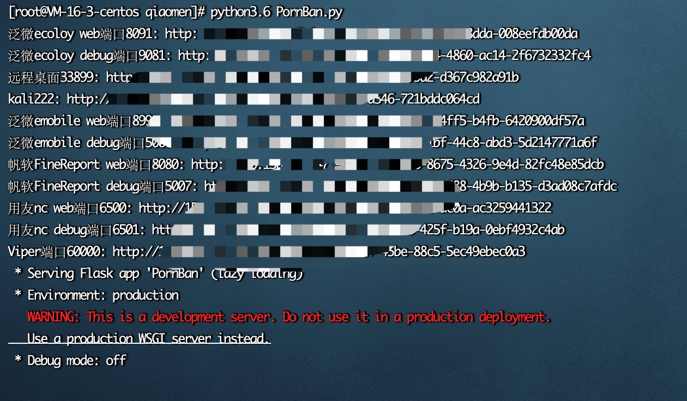

# portBan
用来方便利用防火墙进行屏蔽和开放端口的敲门脚本

***

使用：

~~~
python3 PortBan.py
~~~

配置文件

~~~
webport: 9929
init: iptables -F
rules:
  - port: 50050
    prompt: cs连接端口
    path: csqiaomen

  - port: 4443
    prompt: viper端口

  - port: 6666
    prompt: cs监听器端口
    release:
      - 111.111.111.111
~~~

* （必填）port	提供web访问的端口
* （必填）init      运行时初始化执行的命令
* （必填）rules   规则列表
  * （必填）port 	  需要敲门才能访问的端口
  * （必填）prompt  提示，展示用的
  * （可选）path       敲门的路径，无此选项则随机生成uuid
  * （可选）release   白名单列表，无需敲门即可访问端口的ip列表

